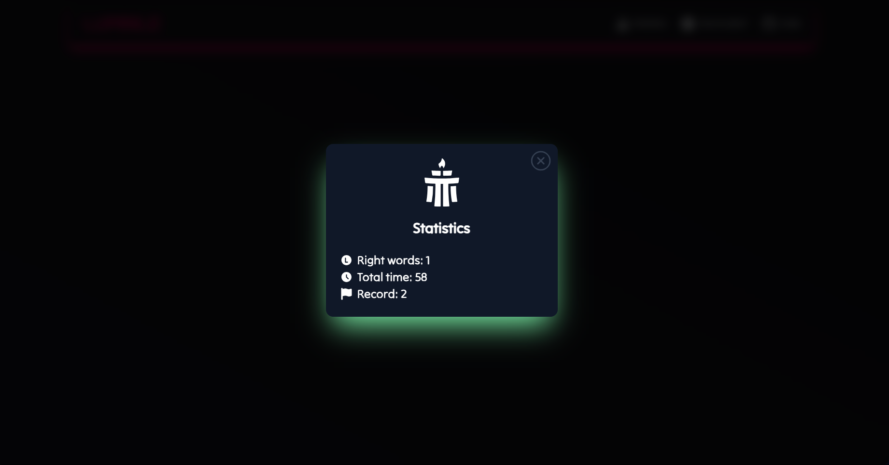
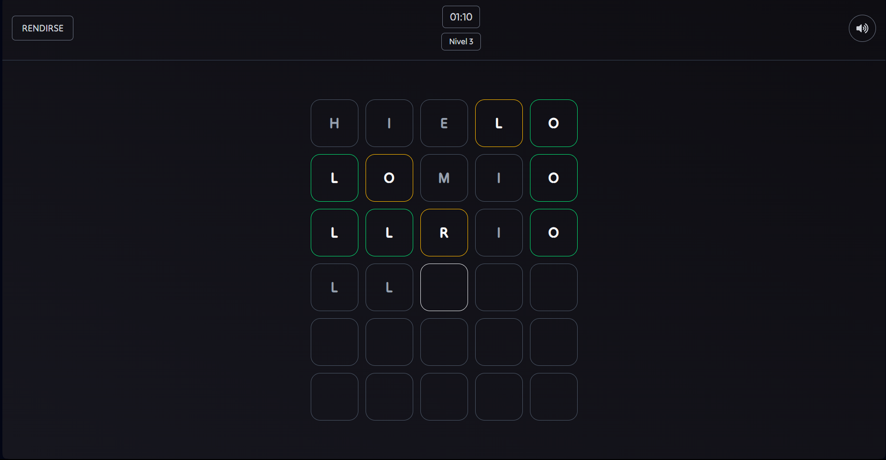
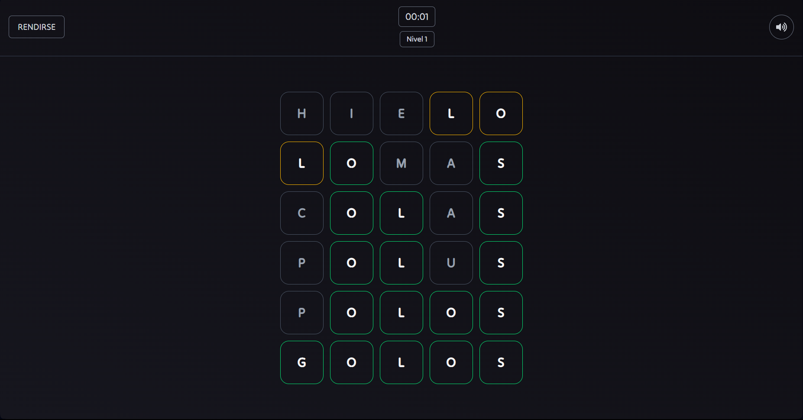

# LUMINLE 


   


I developed an adaptation of the famous game WORDLE, with the purpose of giving it an own and authentic touch, also an arcade gameplay to make it more interesting. 

I invite you to use it, with the following link:

https://github.com/Luis3Fernando/Luminle

---

## 🎮 Gameplay

- Guess the hidden Spanish word within the time limit.

- Each correct guess adds extra time.

- Levels increase difficulty up to level 60.

---

## 🚀 Features

- Neon dark theme for a cool visual experience

- Progressive time bonus for each correct guess

- Spanish vocabulary with increasing difficulty

- Statistics saved locally to track your performance

---

## 📸 Screenshots 
When accessing the game you will see the following interfaces:


You will be able to see informative panels:




---
## 🕹 How to Play

- 🟨 A yellow box means the letter is in the word but in the wrong position.

- 🟩 A green box means the letter is in the correct position.

- ⬜ An uncolored box means the letter does not belong to the word.

**Examples**




---

## 🛠 Technologies Used

- Programming language: TypeScript 

- Framework: React with Vite

- styles: tailwindcss

- Tools: Local storage, redux, hooks


## ⚙️ Installation

If you want to download it or adapt it to your environment, follow the steps to run it on your local computer:

```bash
git clone https://github.com/Luis3Fernando/Luminle
```
```bash
cd Luminle
```
```bash
npm install
```

```bash
npm run dev
```

